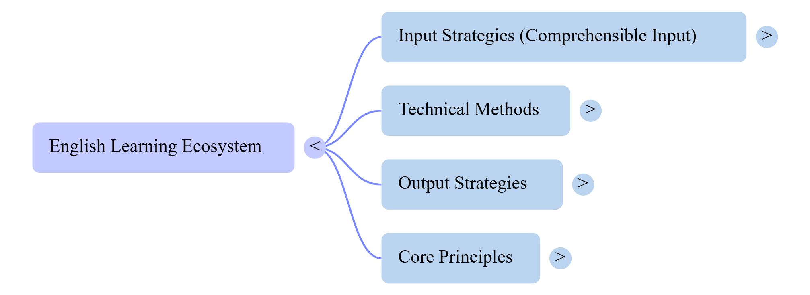

# 📘 Practical Strategies for Accelerated English usando NotebookLM

## 🎯 Contexto e Objetivos

Este projeto apresenta um **Caderno Temático desenvolvido utilizando o NotebookLM como ferramenta de aprendizagem ativa**, explorando como a Inteligência Artificial pode auxiliar na organização do conhecimento, pesquisa e evolução dos estudos.

O tema escolhido foi:

# **Practical Strategies for Accelerated English**

O objetivo deste estudo foi investigar estratégias práticas para acelerar o aprendizado do idioma inglês, principalmente para estudantes autodidatas que desejam evoluir suas habilidades utilizando métodos eficientes e ferramentas digitais.

Durante o desenvolvimento do projeto foram analisadas técnicas relacionadas a:

- Listening (compreensão auditiva);
- Speaking (fala e conversação);
- Reading (leitura);
- Writing (escrita);
- Desenvolvimento de vocabulário;
- Uso de Inteligência Artificial no aprendizado;
- Técnicas de memorização e exposição ao idioma.

A proposta também foi demonstrar como a Inteligência Artificial pode ser utilizada como uma ferramenta de aprendizagem ativa, ajudando na análise de fontes, organização de informações e criação de materiais personalizados.

---

# 📚 Curadoria de Fontes

As fontes utilizadas no NotebookLM foram selecionadas com foco em estratégias modernas de aquisição de idiomas.

## 1. Técnica de Shadowing

Fontes utilizadas:

- [Complete Guide] How to Do English Shadowing? Explaining How to Create Study Materials for Free!
- Accelerate Your English Learning with the Shadowing Technique
- Shadowing Technique: improve your speaking in the most effective way
- Shadowing: The Technique That Transforms Your English Speaking
- The Shadowing Technique: A Complete Guide for Language Learners

### Objetivo:

Compreender como a repetição de áudios em inglês pode melhorar:

- Pronúncia;
- Fluência;
- Entonação;
- Ritmo da fala;
- Confiança na comunicação.

---

# 2. Comprehensible Input (Insumo Compreensível)

Fontes utilizadas:

- The Case for Comprehensible Input - Stephen Krashen
- Is it true that the comprehensible input hypothesis by Stephen Krashen is the best way to learn languages?

### Objetivo:

Analisar a teoria de Stephen Krashen sobre aquisição de idiomas através da exposição a conteúdos compreensíveis.

Principais conceitos:

- Hipótese i+1;
- Aprendizado através do contexto;
- Exposição constante ao idioma;
- Redução do filtro afetivo.

---

# 3. Repetição Espaçada e Anki

Fontes utilizadas:

- Best Anki Settings for Language Learning (2026 Guide) - Migaku
- Best Anki Settings for Language Learning: 2026 Guide - StudyCards AI
- Best Anki Settings: My Recommended Values - Leananki
- Learning words with Anki - Refold Roadmap Library
- How to use Anki for language learning in the most effective way?

### Objetivo:

Compreender como a repetição espaçada auxilia na retenção de vocabulário e construção de memória de longo prazo.

---

# 4. Conteúdo Autêntico e Imersão

Fontes utilizadas:

- 12 best English podcasts to learn English at any level - Preply
- BBC Learning English Review
- Extensive reading and learner autonomy
- ENGLISH E-READER
- Readlang

### Objetivo:

Avaliar formas de aumentar a exposição ao inglês real através de:

- Podcasts;
- Livros;
- Vídeos;
- Leitura extensiva;
- Materiais adaptados.

---

# 5. Aprendizado Autodidata

Fontes utilizadas:

- Como aprender inglês sozinho;
- Como eu aprendi inglês do ZERO, em casa e sem cursos;
- COMO melhorar seu INGLÊS meia boca (Mairo Vergara);
- Relatório do Deep Research: Diretrizes Metodológicas para a Transição Autodidata ao Inglês Intermediário.

### Objetivo:

Analisar estratégias utilizadas por estudantes independentes para evoluir no idioma.

---

# 🤖 Engenharia de Prompts e Cicatrizes

Durante o desenvolvimento deste projeto no NotebookLM foram realizados testes de prompts para entender como a Inteligência Artificial poderia auxiliar no aprendizado do inglês.

---

# Prompt inicial utilizado

## Pergunta:

> O ChatGPT gratuito me ajudaria a evoluir meu inglês para intermediário?

## Objetivo:

Avaliar se uma ferramenta gratuita de Inteligência Artificial poderia auxiliar um estudante autodidata na evolução do nível básico para intermediário em inglês.

---

# Resultado obtido

A análise mostrou que o ChatGPT pode atuar como um parceiro de estudos auxiliando em:

- Prática de conversação;
- Correção de textos;
- Explicação de gramática;
- Criação de exercícios personalizados;
- Desenvolvimento de vocabulário;
- Simulação de situações reais de comunicação.

---

# Prompt aprimorado

> Crie um plano de estudos para um aluno brasileiro iniciante em inglês que deseja alcançar o nível intermediário usando ChatGPT, Shadowing, Anki e conteúdos gratuitos.

## Resultado:

A resposta apresentou uma estratégia mais estruturada envolvendo:

- Rotina diária de estudos;
- Técnicas de memorização;
- Prática de conversação;
- Ferramentas gratuitas;
- Exposição constante ao idioma.

---

# Cicatrizes do processo

Durante o desenvolvimento foram identificados alguns desafios:

- Perguntas muito amplas geraram respostas genéricas;
- Foi necessário melhorar a descrição do objetivo;
- Prompts mais específicos produziram respostas mais úteis;
- A organização das fontes por assunto aumentou a qualidade das respostas.

---

# 📖 Miniguia de Estudo

# 1. Conceitos Principais

## Comprehensible Input

A teoria de Stephen Krashen afirma que adquirimos uma língua quando conseguimos compreender mensagens, e não apenas através da memorização de regras.

O conceito principal é o **i+1**, onde o estudante deve ter contato com conteúdos levemente acima do seu nível atual.

---

## Filtro Afetivo

São barreiras emocionais que podem prejudicar o aprendizado:

- Ansiedade;
- Medo de errar;
- Falta de motivação.

Para reduzir esse filtro, recomenda-se utilizar conteúdos interessantes e relacionados aos interesses pessoais.

---

## Prosódia

É a "música" do idioma, envolvendo:

- Entonação;
- Ritmo;
- Ênfase;
- Melodia da fala.

---

## Repetição Espaçada (SRS)

Sistema que apresenta informações em intervalos planejados para fortalecer a memória de longo prazo.

O Anki utiliza esse conceito para auxiliar no aprendizado de vocabulário.

---

# 2. Estratégias de Aprendizado

## Shadowing

Consiste em repetir um áudio nativo quase simultaneamente, normalmente com atraso de 1 a 2 segundos.

Benefícios:

✅ Melhora da pronúncia  
✅ Desenvolvimento da fluência  
✅ Melhoria da entonação  
✅ Maior naturalidade na fala  

---

## Escuta Ativa com Podcasts

Estratégia recomendada:

1. Ouvir com transcrição;
2. Selecionar poucas palavras novas;
3. Ouvir novamente sem texto;
4. Repetir regularmente.

Exemplos:

- BBC Learning English;
- 6 Minute English;
- Podcasts educativos.

---

## Leitura Extensiva

Consiste em ler conteúdos de interesse pessoal para aumentar naturalmente o vocabulário.

Recomendações:

- Utilizar livros adaptados (*graded readers*);
- Escolher materiais onde aproximadamente 95% das palavras sejam compreendidas.

---

## Sentence Mining

Consiste em aprender frases completas em vez de palavras isoladas.

Exemplo:

❌ Improve = melhorar

✅ I want to improve my English skills.

O aprendizado através de contexto facilita o uso natural do idioma.

---

# 3. Vocabulário e Ferramentas

| Termo | Significado |
|---|---|
| Shadowing | Técnica de repetição da fala nativa |
| Anki | Ferramenta de repetição espaçada |
| FSRS | Algoritmo moderno de revisão |
| Chunk | Grupo de palavras utilizadas juntas |
| Readlang | Ferramenta de leitura com tradução instantânea |
| Immersion | Exposição constante ao idioma |
| Fluency | Fluência |

---

# 4. Exemplos Práticos

## Configuração do Anki

Recomendações:

- Criar 15 a 20 cartões novos por dia;
- Utilizar frases completas;
- Adicionar áudio e imagens;
- Fazer revisões frequentes.

Exemplo:

**Frente:**

The dog is in the garden.

**Verso:**

Dog + imagem + áudio nativo.

---

## Prática de fala com Inteligência Artificial

A IA pode auxiliar através de:

- Simulação de conversas;
- Roleplays;
- Correção de erros;
- Feedback imediato.

Sugestão:

10 a 15 minutos diários de prática.

---

# 5. Conclusões

## Consistência é mais importante que intensidade

Estudar 15 minutos todos os dias é mais eficiente do que estudar muitas horas apenas uma vez por semana.

---

## Input antes do Output

A compreensão auditiva e a leitura devem formar a base antes de exigir uma produção avançada.

---

## Anki é uma ferramenta, não o objetivo final

O Anki ajuda a criar uma base inicial de vocabulário, mas a evolução acontece através da exposição real ao idioma:

- Filmes;
- Livros;
- Podcasts;
- Conversas.

---

## Mentalidade Autodidata

O aprendizado de adultos depende de:

- Consistência;
- Curiosidade;
- Contato frequente com o idioma;
- Materiais adequados ao nível atual.

---

# 🤖 Prompts Reutilizáveis

## Criar plano de estudos

```
Crie um plano de estudos de inglês de 30 dias utilizando Shadowing, Anki e Comprehensible Input.
```

---

## Treinar conversação

```
Atue como um professor de inglês. Converse comigo, corrija meus erros e explique formas mais naturais de falar.
```

---

## Melhorar vocabulário

```
Crie uma lista de palavras e expressões em inglês com exemplos reais de conversação.
```

---

## Revisar conteúdo

```
Resuma este material em tópicos principais e crie perguntas para testar meu conhecimento.
```

---

# ✅ Conclusão Final

O desenvolvimento deste Caderno Temático demonstrou como a Inteligência Artificial pode ser utilizada como uma ferramenta de aprendizagem ativa.

O NotebookLM permitiu transformar diversas fontes em um guia estruturado de estudo, reunindo conceitos, estratégias e práticas para acelerar o aprendizado de inglês.

Este projeto demonstra a aplicação de IA na organização do conhecimento, engenharia de prompts e desenvolvimento contínuo de habilidades.
